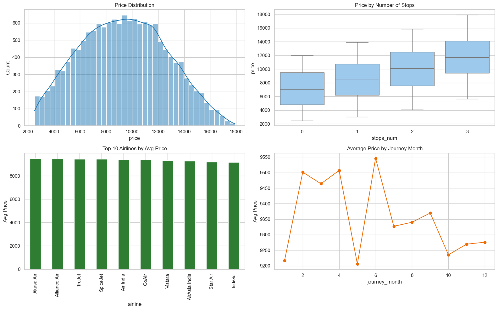

# Flight Price Analysis, Machine Learning, and Power BI Dashboard

## Project Overview
This project analyzes flight pricing data, builds a machine learning model to predict ticket prices, performs hyperparameter tuning using `GridSearchCV`, and prepares Power BI-ready datasets for interactive reporting.

Main notebook: `Flight.ipynb`  
Dataset: `flights.csv`

## Objectives
- Clean and transform raw flight data
- Create insight-ready columns and business KPIs
- Perform exploratory data analysis (EDA)
- Train and evaluate a regression model for fare prediction
- Improve model performance using `GridSearchCV`
- Export structured tables for an attractive Power BI dashboard

## Tech Stack
- Python: `pandas`, `numpy`, `matplotlib`, `seaborn`
- Scikit-learn: preprocessing pipelines, `RandomForestRegressor`, `GridSearchCV`
- Model persistence: `joblib`
- BI: Power BI

## Dataset Columns
Original dataset includes:
- `index`, `airline`, `date_of_journey`, `Source`, `destination`, `route`
- `dep_time`, `Arrival_time`, `Duration`, `Total_stops`, `Additional_info`, `Price`

## Notebook Workflow
The notebook is organized into polished markdown sections:
1. Setup and imports
2. Load data
3. Data profiling and quality audit
4. Cleaning and feature engineering
5. Required insights (EDA + KPIs)
6. Machine learning pipeline
7. Hyperparameter tuning with `GridSearchCV`
8. Save model artifacts
9. Prepare Power BI-ready exports
10. Power BI dashboard blueprint

## Cleaning and Feature Engineering
Created features include:
- Date features: `journey_year`, `journey_month`, `journey_day`, `journey_weekday`, `is_weekend`
- Duration features: `duration_minutes`, `duration_hours`
- Stops feature: `stops_num`
- Time features: `dep_hour`, `dep_minute`, `arr_hour`, `arr_minute`
- Business segment: `dep_time_block`

Modeling note:
- High-cardinality fields (`route`, `additional_info`) are excluded from ML training for faster and more stable `GridSearchCV`, but retained for BI analysis.

## Machine Learning
- Problem type: Regression
- Target: `price`
- Baseline model: `RandomForestRegressor`
- Pipeline:
  - Numeric: median imputation
  - Categorical: most-frequent imputation + one-hot encoding

### Evaluation Metrics
- `R2`
- `MAE`
- `RMSE`
- `MAPE`


## Current Results (From Latest Run)
Model comparison on your dataset:

| Model | R2 | MAE | RMSE |
|---|---:|---:|---:|
| GradientBoosting | 0.237886 | 2464.325057 | 2882.214071 |
| RandomForest | 0.228672 | 2473.557726 | 2899.585257 |
| ExtraTrees | 0.225603 | 2478.704365 | 2905.347878 |

Best baseline model: `GradientBoosting`  
Current best R2: `0.237886`

## Hyperparameter Tuning
`GridSearchCV` is used to tune key Random Forest parameters such as:
- `n_estimators`
- `max_depth`
- `min_samples_split`
- `min_samples_leaf`
- `max_features`

The notebook compares baseline and tuned model performance in a metrics table.

## Output Artifacts
After running the notebook, these folders/files are generated:

### 1) Model Artifacts (`artifacts/`)
- `flight_price_model.joblib`
- `model_features.joblib`

### 2) Power BI Exports (`powerbi_exports/`)
- `powerbi_flights_cleaned.csv`
- `powerbi_kpi.csv`
- `powerbi_airline_summary.csv`
- `powerbi_route_summary.csv`
- `powerbi_monthly_summary.csv`

## Power BI Dashboard Design (Recommended Pages)
1. Executive Overview
- KPI cards: Avg Price, Median Price, Max Price, Total Flights
- Monthly trend line
- Top airlines by average fare

2. Route Intelligence
- Source -> Destination matrix
- Top busiest routes
- Slicers: Airline, Stops, Month, Departure Time Block

3. Operational Patterns
- Fare by number of stops
- Fare by departure time block
- Weekday/month fare pattern

4. Model Insights
- Baseline vs Tuned metrics table
- Best CV score card
- Optional predicted vs actual visual

## How to Run
1. Place `flights.csv` in the project root.
2. Open and run all cells in `Flight.ipynb`.
3. Review model metrics and generated visualizations.
4. Import `powerbi_exports/*.csv` into Power BI.

## Screenshots

### 1) Project Overview


### 2) Model Results


### 3) Power BI Dashboard


## Repository Structure
```text
.
|-- Flight.ipynb
|-- flights.csv
|-- artifacts/                  # created after running notebook
|-- powerbi_exports/            # created after running notebook
```

## Future Improvements
- Try gradient boosting models (`XGBoost`, `LightGBM`, `CatBoost`) for accuracy uplift
- Add outlier treatment and robust time-split validation
- Build a simple prediction app (Streamlit/Flask)

## Author
Vinayak Kesarkar  
GitHub: https://github.com/Romii1010/vinayak-portfolio
