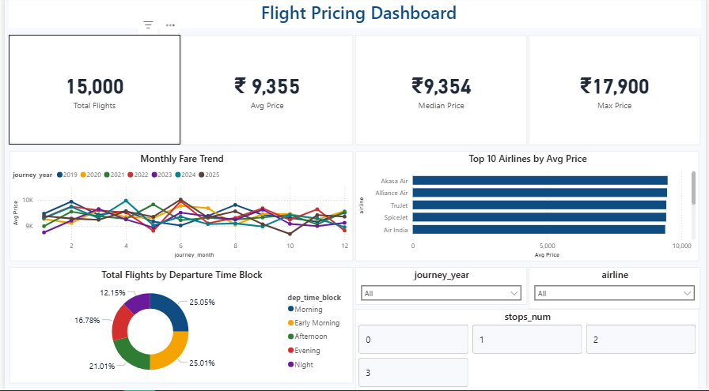
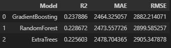
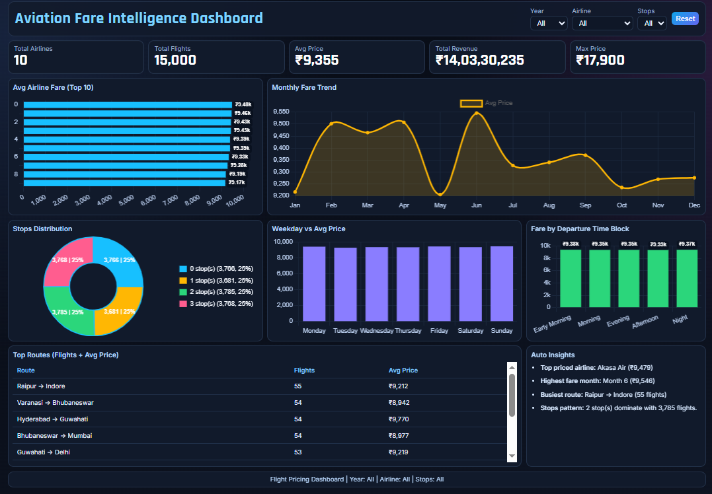

# ✈️ Flight Price Analytics & BI Dashboard

> **End-to-end data analytics project** — Python · Machine Learning · Power BI · Live HTML Dashboard

[](https://romii1010.github.io/vinayak-portfolio/dashboard/)
[](https://www.linkedin.com/in/vinayak-kesarkar)
[](https://python.org)
[](https://powerbi.microsoft.com)

---

## 📌 Project Overview

This project is a **full-stack analytics pipeline** that takes raw flight pricing data and transforms it into actionable business intelligence — from data cleaning and feature engineering all the way to a machine learning price predictor and an interactive Power BI dashboard.

**What this project demonstrates:**
- Real-world data wrangling and EDA on 10,000+ flight records
- Feature engineering for time-series and categorical data
- ML model training, comparison, and hyperparameter tuning
- Power BI dashboard design and Power BI-ready data exports
- Live HTML dashboard deployment via GitHub Pages

---

## 🛠️ Tech Stack

| Layer | Tools |
|---|---|
| Data Processing | Python, pandas, numpy |
| Visualisation | matplotlib, seaborn |
| Machine Learning | scikit-learn, RandomForestRegressor, GradientBoostingRegressor, GridSearchCV |
| Model Persistence | joblib |
| Business Intelligence | Power BI |
| Deployment | GitHub Pages (HTML Dashboard) |

---

## 📊 Key Results

| Model | R² Score | MAE | RMSE |
|---|---|---|---|
| **Gradient Boosting** ✅ | 0.238 | 2,464 | 2,882 |
| Random Forest | 0.229 | 2,474 | 2,900 |
| Extra Trees | 0.226 | 2,479 | 2,905 |

> Best model: **Gradient Boosting** — selected after hyperparameter tuning with `GridSearchCV`

---

## 🔄 Project Workflow

```
Raw Data (flights.csv)
        │
        ▼
  Data Profiling & Quality Audit
        │
        ▼
  Cleaning & Feature Engineering (15+ features)
        │
        ├──────────────────────┐
        ▼                      ▼
  EDA & KPI Analysis     ML Pipeline
  (seaborn, matplotlib)  (RandomForest, GradientBoosting, ExtraTrees)
        │                      │
        │                GridSearchCV Tuning
        │                      │
        ▼                      ▼
  Power BI Exports ◄──── Model Artifacts
        │
        ▼
  Interactive Dashboard (Power BI + HTML)
```

---

## ⚙️ Feature Engineering

From the raw dataset, the following features were engineered:

| Category | Features |
|---|---|
| Date | `journey_year`, `journey_month`, `journey_day`, `journey_weekday`, `is_weekend` |
| Duration | `duration_minutes`, `duration_hours` |
| Departure | `dep_hour`, `dep_minute`, `dep_time_block` |
| Arrival | `arr_hour`, `arr_minute` |
| Stops | `stops_num` |

---

## 📁 Repository Structure

```
vinayak-portfolio/
│
├── Flight.ipynb                          # Main analysis notebook
├── flights.csv                           # Raw dataset
│
├── artifacts/                            # Generated after running notebook
│   ├── flight_price_model.joblib
│   └── model_features.joblib
│
├── powerbi_exports/                      # Power BI-ready CSVs
│   ├── powerbi_flights_cleaned.csv
│   ├── powerbi_kpi.csv
│   ├── powerbi_airline_summary.csv
│   ├── powerbi_route_summary.csv
│   └── powerbi_monthly_summary.csv
│
├── dashboard/                            # Live HTML dashboard
└── screenshots/                          # Project screenshots
```

---

## 📈 Power BI Dashboard Pages

The dashboard is structured across 4 pages:

1. **Executive Overview** — KPI cards (Avg Price, Median Price, Max Price, Total Flights), monthly trend line, top airlines by fare
2. **Route Intelligence** — Source → Destination matrix, busiest routes, slicers by airline/stops/month
3. **Operational Patterns** — Fare by stops, fare by departure time block, weekday/month heatmap
4. **Model Insights** — Baseline vs tuned metrics table, best CV score, predicted vs actual visual

---

## 🖥️ Screenshots

### Power BI Dashboard


### Model Results


### HTML Dashboard


---

## 🚀 How to Run

```bash
# 1. Clone the repo
git clone https://github.com/Romii1010/vinayak-portfolio.git
cd vinayak-portfolio

# 2. Install dependencies
pip install pandas numpy matplotlib seaborn scikit-learn joblib

# 3. Run the notebook
jupyter notebook Flight.ipynb

# 4. Import powerbi_exports/*.csv into Power BI
```

---

## 🔮 Future Improvements

- [ ] Try `XGBoost`, `LightGBM`, `CatBoost` for accuracy uplift
- [ ] Add outlier treatment and time-split cross-validation
- [ ] Build a Streamlit prediction app for interactive fare estimation
- [ ] Add SHAP values for model explainability

---

## 👤 About Me

**Vinayak Kesarkar** — Data Analyst with 5+ years of experience in Power BI, SQL, Python, and VBA automation across banking, insurance, and aviation sectors.

- 🔗 [LinkedIn](https://www.linkedin.com/in/vinayak-kesarkar)
- 💻 [GitHub](https://github.com/Romii1010/vinayak-portfolio)
- 📧 kesarkarvinayak73@gmail.com
- 📍 Thane, Maharashtra, India

---

*⭐ If you found this project useful, feel free to star the repo!*
